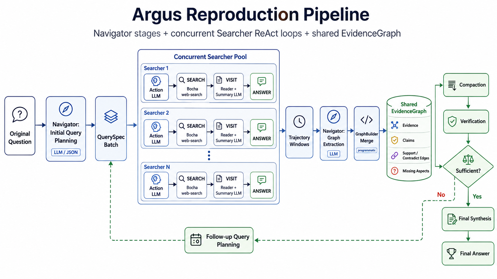

# Argus Reproduction

Unofficial reproduction of the inference framework described in
[Argus: Evidence Assembly for Scalable Deep Research Agents](https://arxiv.org/abs/2605.16217).

This repository implements a transparent Navigator/Searcher-style research harness: a Navigator
plans and verifies work over a shared evidence graph, while ReAct Searchers use web search and page
or file visits to collect evidence for assigned sub-queries.

This is not an official implementation and does not include the paper authors' model weights. The
focus is inference-time orchestration, prompts, graph state, tool calls, logging, benchmark hooks,
and an inspection UI with configurable external LLM backends.



## Structure

```text
argus_repro/
  agents/       Navigator, Searcher, and prompt templates
  core/         Configuration, schemas, logging, run paths, and utilities
  evaluation/   Benchmark loading and evaluation helpers
  frontend/     aiohttp frontend server and static UI
  graph/        Evidence graph merge and verification updates
  providers/    LLM, search, and visit providers
  runners/      CLI entry points

data/benchmarks/  Placeholder for external benchmark data
docs/pipeline.md  Detailed pipeline report
```

## Install

Python 3.11 or newer is recommended.

```bash
python -m venv .venv
source .venv/bin/activate
python -m pip install -U pip
pip install -r requirements.txt
```

Optional `crawl4ai` reader support:

```bash
pip install -r requirements-crawl4ai.txt
python -m playwright install chromium
```

## Configure

Create a local environment file and fill in credentials:

```bash
cp .env.example .env
```

Required:

```text
DASHSCOPE_API_KEY
BOCHA_API_KEY
```

Optional for Jina Reader:

```text
JINA_API_KEY
```

Model routing, budgets, proxies, thinking flags, and retry settings are documented in
`.env.example`.

## Run

Run one question:

```bash
python -m argus_repro.runners.run_argus_repro \
  --question "What county contains the capital of the state where Microsoft is headquartered?" \
  --k 3 \
  --max-rounds 3
```

Run one benchmark item:

```bash
python -m argus_repro.runners.run_benchmark_one \
  --benchmark xbench_deepsearch_2510 \
  --index 0 \
  --k 4 \
  --max-rounds 4
```

Benchmark data is not bundled. Place external data under
`data/benchmarks/exports/<benchmark_name>/...` following
`argus_repro/evaluation/benchmarks.py`.

## Frontend

Start the local UI:

```bash
python -m argus_repro.frontend.server --host 127.0.0.1 --port 7860
```

Open:

```text
http://127.0.0.1:7860
```

The UI shows run settings, Navigator progress, Searcher trajectories, ReAct steps, workflow graphs,
evidence graphs, prompts, schemas, event logs, and final answers.

## Documentation

See [docs/pipeline.md](docs/pipeline.md) for the full pipeline report, including LLM-call roles,
workflow diagrams, state schemas, budgets, and known implementation limitations.
