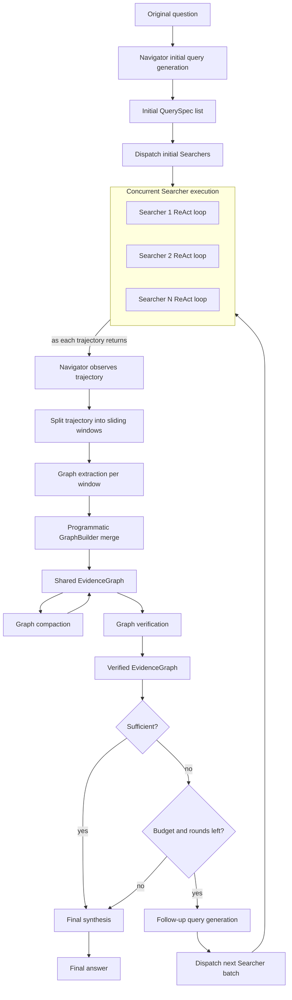
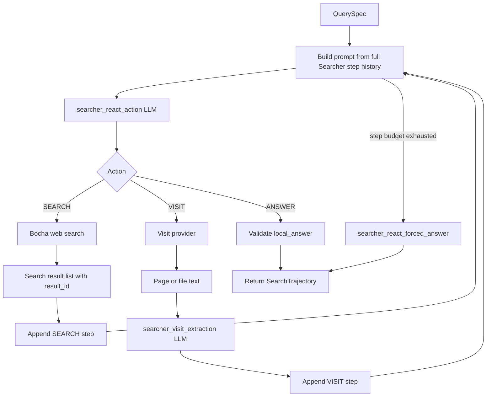
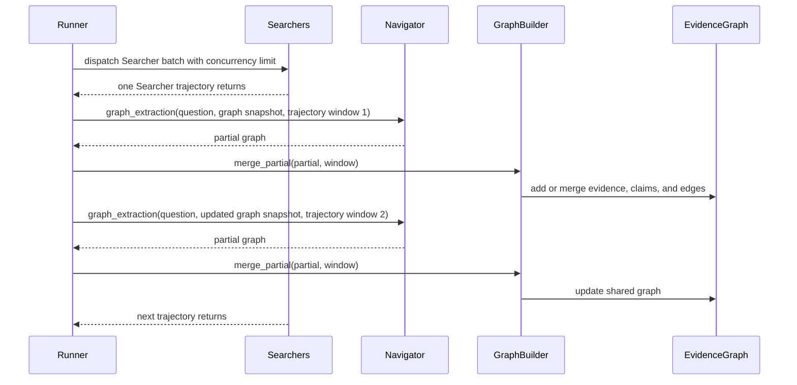

# Argus Reproduction Pipeline Report

This document describes the inference pipeline implemented in this repository. It is intended for readers who want to understand how the reproduction maps the Argus-style Navigator/Searcher design into executable code.

The project is an unofficial reproduction of the inference framework described in [arXiv:2605.16217](https://arxiv.org/abs/2605.16217). It implements the orchestration layer, prompt schemas, evidence graph state, tool calls, logging, benchmark hooks, and inspection UI. It does not include official model weights or an official implementation from the paper authors.

## LLM Call Roles

The system contains several LLM-powered roles. They share the same OpenAI-compatible client, but each call is stateless unless the runner explicitly includes graph state, trajectory state, or tool observations in the prompt.

| Stage | Role | Model config | JSON output | Thinking flag | Main input | Main output |
| --- | --- | --- | --- | --- | --- | --- |
| `navigator_initial_queries` | Navigator planning | `ARGUS_NAVIGATOR_PLANNING_MODEL` | Yes | `ARGUS_NAVIGATOR_ENABLE_THINKING` | Original question, initial dispatch cap, remaining Searcher budget | Initial `QuerySpec[]` |
| `searcher_react_action` | Searcher ReAct policy | `ARGUS_SEARCHER_MODEL` | Yes | `ARGUS_SEARCHER_ENABLE_THINKING` | One `QuerySpec`, full Searcher step history, remaining step budget | One action: `SEARCH`, `VISIT`, or `ANSWER` |
| Bocha `/web-search` | Search tool | None | No | No | Search query emitted by Searcher | Ranked search results with title, URL, source, time, and snippet |
| `searcher_visit_extraction` | Visit summarization and evidence extraction | `ARGUS_SUMMARY_MODEL` | Yes | `ARGUS_SEARCHER_ENABLE_THINKING` | Reader text, visit goal, source URL and title | Goal-focused evidence, summary, relevance, and missing information |
| `searcher_react_forced_answer` | Searcher forced local answer | `ARGUS_SEARCHER_MODEL` | Yes | `ARGUS_SEARCHER_ENABLE_THINKING` | Full Searcher step history | Local answer when the step budget is exhausted |
| `navigator_graph_extraction` | Navigator observation and graph extraction | `ARGUS_GRAPH_EXTRACTION_MODEL` | Yes | `ARGUS_NAVIGATOR_ENABLE_THINKING` | Original question, current graph snapshot, one trajectory window | Partial graph: new evidence, claims, and edges |
| `navigator_graph_compaction` | Navigator graph compaction | `ARGUS_GRAPH_COMPACTION_MODEL` | Yes | `ARGUS_NAVIGATOR_ENABLE_THINKING` | Current graph | Claim merge groups |
| `navigator_verification` | Navigator verification | `ARGUS_VERIFICATION_MODEL` | Yes | `ARGUS_NAVIGATOR_ENABLE_THINKING` | Current graph and original question | Claim updates, answer path, missing aspects, sufficiency |
| `navigator_followups` | Navigator follow-up planning | `ARGUS_NAVIGATOR_PLANNING_MODEL` | Yes | `ARGUS_NAVIGATOR_ENABLE_THINKING` | Verified graph, answer path, missing aspects, remaining budget | Follow-up `QuerySpec[]` |
| `navigator_synthesis` | Navigator final synthesis | `ARGUS_SYNTHESIS_MODEL` | Yes | `ARGUS_NAVIGATOR_ENABLE_THINKING` | Final verified graph and answer path | Final answer, key claims, uncertainties, citations |
| Benchmark judge | Evaluation | `ARGUS_JUDGE_MODEL` | Benchmark-dependent | No separate pipeline flag | Question, reference answer, model answer | Score or correctness judgement |

Important properties:

- Searcher LLM calls and Navigator LLM calls do not share conversation history.
- Navigator memory is represented primarily by the external `EvidenceGraph`.
- The visit reader is not itself an LLM. It retrieves page or file text. The summary model then turns that text into a goal-focused observation for the Searcher.

## Workflow

The high-level workflow is:



## Searcher ReAct Loop

Each Searcher receives one `QuerySpec` and runs independently. Several Searchers may run concurrently, but each Searcher executes its own ReAct loop sequentially.



Search results exposed to the Searcher use this shape:

```json
{
  "result_id": "R1",
  "rank": 1,
  "title": "...",
  "url": "...",
  "source": "...",
  "published_time": "...",
  "snippet": "..."
}
```

`result_id` is generated by the program, not by Bocha. The current deduplication key is:

```text
title + url + source + published_time + snippet + summary
```

Because Bocha summaries are disabled in this harness, practical result identity is mostly determined by title, URL, source, published time, and snippet.

## Navigator Observation

Searcher batches are launched concurrently, but graph extraction is performed as trajectories return. The runner does not wait for the full batch before updating the graph.



This design keeps graph updates close to the paper-style "observe trajectory, update graph" workflow while still allowing Searcher execution to be asynchronous.

## Core State

### QuerySpec

`QuerySpec` is the task assigned to a Searcher. It is not a persistent agent memory.

| Field | Meaning |
| --- | --- |
| `query` | Main research task for the Searcher |
| `angle` | Investigation angle |
| `why` | Why this Searcher is needed |
| `target_claim_or_aspect` | Specific claim or aspect to resolve |
| `expected_evidence` | Evidence type expected from the Searcher |
| `source_preference` | Preferred source type |
| `entity_aliases` | Useful aliases |
| `avoid_scope` | Directions to avoid |
| `priority` | `high`, `medium`, or `low` |

### SearchTrajectory

`SearchTrajectory` is the complete record returned by one Searcher.

| Field | Meaning |
| --- | --- |
| `searcher_id` | Searcher instance ID |
| `query` | Assigned query |
| `steps` | Full ReAct step history: `SEARCH`, `VISIT`, `ANSWER`, `CORRECTION` |
| `local_answer` | Searcher-local answer |
| `started_at`, `finished_at` | Timestamps |

The current local answer schema is:

```json
{
  "local_answer": "...",
  "key_claims": [
    {
      "claim": "...",
      "evidence_urls": ["https://..."],
      "rationale": "...",
      "confidence": 0.0,
      "unresolved": false
    }
  ],
  "unresolved_questions": ["..."]
}
```

Graph extraction does not rely only on `local_answer`. It can extract evidence, claims, and edges from intermediate `SEARCH` and `VISIT` observations inside each trajectory window.

### EvidenceGraph

`EvidenceGraph` is the Navigator's shared external memory.

| Field | Meaning |
| --- | --- |
| `evidence_nodes` | Source-grounded evidence spans |
| `claim_nodes` | Atomic factual claims |
| `edges` | Support, contradiction, or context relationships from evidence/claim nodes to claim nodes |
| `missing_aspects` | Gaps identified by verification |
| `answer_path_requirements` | Bridge facts required for a sufficient final answer |
| `rounds_completed` | Completed Navigator rounds |
| `searcher_call_count` | Searcher calls consumed |
| `max_searcher_calls` | Total Searcher budget |
| `sufficient` | Whether verification considers the graph sufficient |
| `stop_reason` | Why the run stopped |

### EvidenceNode

An evidence node is not simply a URL. It represents a source URL plus an extracted evidence text span.

The evidence fingerprint is:

```text
normalized_url + normalized_evidence_text
```

This allows multiple evidence nodes from the same URL when the extracted spans differ. The current schema is still coarse for archives and tabular data: member path, row, line, and span are not first-class fields yet.

### ClaimNode and Edge

The graph stores explicit `edges`, and each claim also stores derived support and contradiction ID lists.

The canonical topology is the `edges` list. When verification updates a claim's support or contradiction references, `GraphBuilder` rebuilds the incoming support/contradict edges for that claim and then re-syncs the claim's derived reference lists from the edge set.

This avoids having two independent graph topologies drift apart.

### MissingAspect and AnswerPathRequirement

`missing_aspects` are recomputed by verification from the current graph. They are not persistent outputs from graph extraction.

`answer_path_requirements` are verification's decomposition of the original question into bridge facts required for a sufficient answer. Final synthesis is instructed to stay conservative when the graph is not sufficient or when any answer-path requirement remains missing, weak, or contradicted.

## Budgets and Stopping Conditions

Important Navigator-side controls:

| Config | Meaning |
| --- | --- |
| `ARGUS_MAX_INITIAL_DISPATCH` | Maximum Searchers launched in the initial round |
| `ARGUS_MAX_DISPATCH_PER_ROUND` | Maximum follow-up Searchers launched per later round |
| `ARGUS_MAX_SEARCHER_CALLS` | Total Searcher budget for one question |
| `ARGUS_MAX_ROUNDS` | Maximum Navigator rounds |
| `ARGUS_SEARCHER_CONCURRENCY` | Concurrent Searcher limit |
| `ARGUS_TRAJECTORY_WINDOW_SIZE` | Step count per trajectory extraction window |
| `ARGUS_TRAJECTORY_WINDOW_STRIDE` | Sliding-window stride |

Important Searcher-side controls:

| Config | Meaning |
| --- | --- |
| `ARGUS_MAX_SEARCHER_STEPS` | Maximum ReAct steps inside one Searcher |
| `ARGUS_SEARCH_TOP_K` | Search results returned by each Bocha call |
| `ARGUS_SEARCHER_ACTION_MAX_TOKENS` | Searcher action output budget |
| `ARGUS_SEARCHER_FORCED_ANSWER_MAX_TOKENS` | Forced-answer output budget |
| `ARGUS_SEARCHER_VISIT_EXTRACTION_INPUT_MAX_TOKENS` | Reader text budget passed to the visit extraction model |
| `ARGUS_SEARCHER_VISIT_EXTRACTION_MAX_TOKENS` | Visit extraction output budget |

The run stops when one of these conditions is reached:

- verification marks the graph sufficient;
- total Searcher budget is exhausted;
- follow-up generation returns no useful queries;
- maximum Navigator rounds are reached.

If the final observed graph has not yet been verified, the runner performs one final verification before synthesis.

## Known Implementation Limitations

### Visit input compression

The current visit path is:

1. Searcher chooses a URL or result ID to visit.
2. The selected visit provider reads the page or file.
3. The reader text is passed to `searcher_visit_extraction`.
4. Searcher sees the extracted, goal-focused page text rather than the full raw page.

The default input budget for visit extraction is `ARGUS_SEARCHER_VISIT_EXTRACTION_INPUT_MAX_TOKENS=50000`, counted approximately with `tiktoken` using the `cl100k_base` encoding. Large single files can therefore lose relevant information before summarization.

Archives and container files are harder. The reader currently lists the container structure, expands parseable members, divides the remaining token budget across members, marks oversized members with `member_content_exceeds_token_budget`, and includes goal-matched source lines when possible. This is useful, but it is not equivalent to giving an agent local file tools. A stronger implementation would expose file listing, grep, range reads, and table queries as tools.

### Visual and multimodal evidence

The reader primarily exposes text, markdown, links, tables, and downloaded file text. It does not inspect image pixels, video, or GIF content. In a real run, a visit summary model inferred visual content from an image URL even though the reader had not provided the image itself. Verification later treated the resulting claim conservatively, but the summary hallucination had already entered the graph as a candidate lead.

A safer future version should explicitly mark visual-only evidence as unavailable unless a real multimodal reader is used.

### Follow-up planning memory

Follow-up generation sees the original question, the verified graph, answer-path requirements, missing aspects, and remaining budget. It does not currently receive a structured history of previous queries, failed visits, poor search recall, or repeated low-value directions.

The runner performs exact query deduplication, but semantic repeats can still occur. A practical improvement would be a compact `search_history_summary` passed into follow-up planning.

### Long trajectory extraction

Graph extraction reads Searcher trajectories through sliding windows. This reduces single-call context pressure, but it can split useful context across windows, duplicate extraction across overlapping windows, and force the Navigator to parse many control-flow steps.

An experimental alternative is to make Searcher emit a richer structured evidence packet containing exact spans, claims, negative findings, and unresolved gaps. Navigator could then extract from that packet plus selected visit observations. This may reduce noise and cost, but it risks hiding useful intermediate evidence if the Searcher over-compresses its own trajectory.

### Verification calibration

Verification is useful for decomposing the question, identifying weak or missing bridge facts, and preventing overconfident final synthesis. It is not a perfect claim-support calibrator. Its judgement depends on the fidelity of Searcher visits, visit summarization, graph extraction, and follow-up query generation.

## Recommended Next Improvements

1. Add a structured follow-up search history summary.
2. Expose local file exploration tools for large files and archives.
3. Add explicit handling for visual-only evidence.
4. Test a structured Searcher evidence packet against full-trajectory extraction.
5. Improve verification calibration for direct evidence, inferred evidence, and summary-only evidence.
